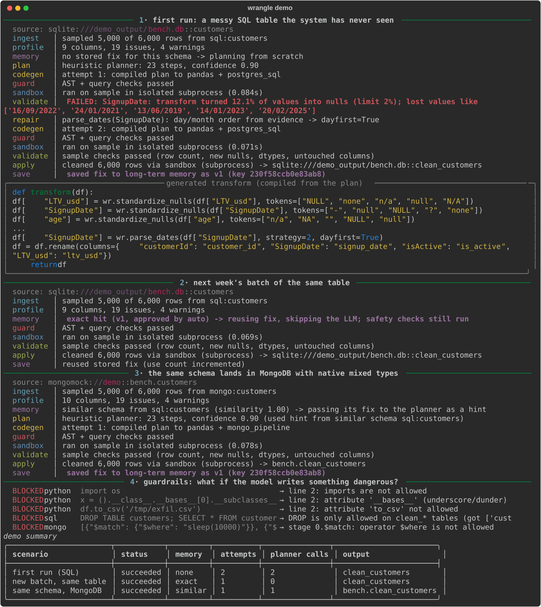
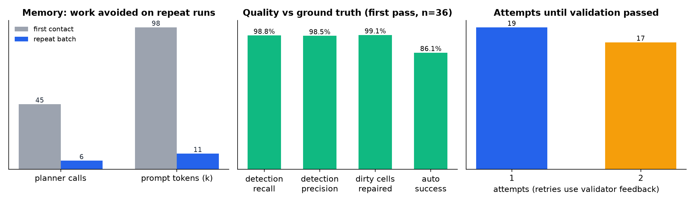
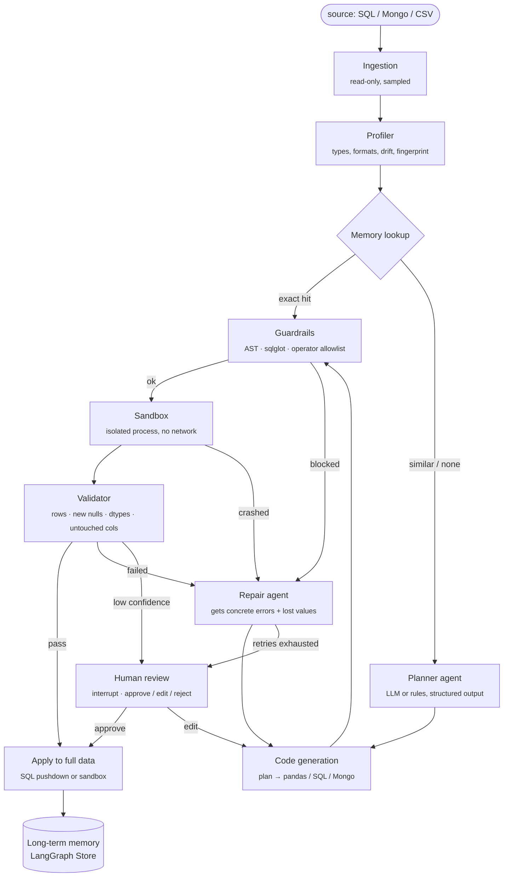

<div align="center">

# 🧹 Agentic Data Wrangler

**A LangGraph multi-agent pipeline that profiles messy SQL, MongoDB and CSV data, generates cleaning transformations, runs them behind layered guardrails, and remembers approved fixes so repeat batches clean themselves.**




</div>

---

## Why

Most data-cleaning time goes to the same loop: eyeball the data, write a one-off pandas or SQL script, notice that `errors="coerce"` quietly turned 30% of a column into `NaN`, patch it, and then redo all of it when next month's batch arrives. LLMs can write that code, but **running model-written code against real data is risky**, and asking a model the same question every week is slow and expensive.

This project automates the loop and makes it safe to leave running:

- **Agents with narrow jobs.** Separate agents ingest, profile, plan, generate code, validate and remember. The LLM is used only where judgment is needed.
- **Defense in depth.** A plan must use an allowlisted set of actions. Generated code is AST-checked, SQL is parsed with `sqlglot`, and Mongo pipelines go through an operator allowlist. Code runs in an isolated sandbox with no network or secrets, then the result is validated against the input before anything is written.
- **Memory.** Approved fixes are stored under a schema fingerprint. The next batch of a known source skips planning entirely (no LLM call) but still passes every safety check. Drift demotes stale fixes automatically.

## Results

Measured on a reproducible benchmark (`python benchmark/run_benchmark.py`) of **36 synthetic datasets** across 6 domains and 3 source types (CSV, SQLite, MongoDB; PostgreSQL is added automatically when the optional `pgtest` extra is installed). The benchmark covers 233k rows and 374k corrupted cells, with **full ground truth**. It runs three passes: first contact, a repeat batch, and upstream drift.



| | first contact | repeat batch | drift |
|---|---:|---:|---:|
| succeeded with no human involved | 86.1% | 100% | 100% |
| paused for human review (low confidence) | 13.9% | 0% | 0% |
| issue detection precision / recall | 98.5% / 98.8% | 98.5% / 98.8% | 100% / 99.5% |
| dirty cells repaired to the correct value | 99.1% | 99.1% | 99.5% |
| clean cells damaged | 0.0% | 0.0% | 0.0% |
| exact memory hits | 0% | 83.3% | 16.7% |
| planner calls | 45 | **6** | 15 |

- **Memory:** 86.7% fewer planner calls and ~9× fewer prompt tokens on repeat batches. Prompt tokens are the size of the prompt the LLM planner would have been sent; the offline benchmark calls no model.
- **Guardrails:** 46/46 red-team programs blocked (imports, dunder escapes, `eval`, file writes, `DROP`/`DELETE`, `pg_read_file`, `$where`, `$out`, …).
- **Where it falls short, on purpose:** 91.4% float repair accuracy. Some weights and heights were silently recorded in lb/in. Every value parses, so no rule can see the error. This is exactly the class of semantic error that still needs a human or a data contract (see [Limitations](#limitations)).

Full breakdown: [`benchmark/results/RESULTS.md`](benchmark/results/RESULTS.md).

> **Caveat:** the corruption generator and the rule engine were written by the same person, so these numbers are an upper bound. Real-world data will have failure modes neither anticipates. The benchmark exists to make regressions visible and trade-offs measurable, not to claim a production accuracy.

## Architecture



Every arrow is a deterministic edge in the graph, not an LLM decision. **Code can't reach the sandbox without passing the guard**, and a human can't approve code that failed it.

| Agent / node | Job | LLM? |
|---|---|---|
| Ingestion | Read-only connection, catalog schema, row count, sample (`TABLESAMPLE` / `$sample`) | no |
| Profiler | Per-column type distributions, null tokens, date formats, categorical variants, Mongo shape conflicts, drift vs baseline, schema fingerprint | no |
| Column matcher | Cost-ordered cascade: exact → normalized → synonyms → fuzzy → value-shape embedding → LLM | last level only |
| Planner | Produces a `CleaningPlan` (Pydantic, `Literal` action allowlist) from a compact profile of problem columns | **yes** (or rules offline) |
| Code generation | Compiles the plan to pandas (vetted `wr.*` helpers), PostgreSQL and a Mongo aggregation pipeline | only for `custom` steps |
| Guard | AST checks for Python, `sqlglot` for SQL, stage/operator allowlist for Mongo | no |
| Sandbox | Separate interpreter, empty env, CPU/memory/time rlimits, socket kill switch (or Docker `--network none`) | no |
| Validator | Row count, **new nulls with the lost values as evidence**, target dtypes, untouched columns unchanged | no |
| Repair | Gets the validator's concrete errors and escalates strategies (e.g. `dayfirst` from evidence) | **yes** (or rules offline) |
| Memory | Versioned fixes keyed by fingerprint, similar-schema hints, demotion on failure | no |

## Quickstart

```bash
git clone https://github.com/Sowmya-Dadheech/multi-agentic-data-wrangler.git && cd multi-agentic-data-wrangler
python -m venv .venv && source .venv/bin/activate
pip install -e ".[dev]"            # add ,pgtest for the embedded-Postgres test (Python ≤3.12)

wrangle demo          # guided tour on generated messy data (no API key needed)
pytest                # 104 tests, including a real Postgres pushdown test
python benchmark/run_benchmark.py
```

Clean your own data:

```bash
wrangle run data/orders.csv
wrangle run "sqlite:///shop.db::customers" --target examples/target_schema.json
wrangle run "postgresql+psycopg2://user:pw@localhost/shop::customers"
wrangle run "mongodb://localhost:27017::shop.orders"
wrangle memory        # what has it learned?
```

Use a real model for planning and repair (any LangChain chat model):

```bash
pip install -e ".[anthropic]"   # or [openai] / [ollama] for fully local
export ANTHROPIC_API_KEY=...
wrangle run data/orders.csv --llm anthropic          # or --llm openai:gpt-4.1-mini, --llm ollama:llama3.1
```

From Python:

```python
from wrangler import Wrangler

w = Wrangler()                                   # sqlite-backed checkpoints + memory in .wrangler/
r = w.run("sqlite:///shop.db::customers")
if r.interrupted:                                # paused for a human (LangGraph interrupt)
    r = w.resume(r.run_id, {"action": "approve"})
print(r.status, r.state["output_ref"])
```

## Guardrails in detail

| Layer | Stops | Implementation |
|---|---|---|
| 1. Least privilege | Writes to source data | Output must go to a new `clean_*` table / collection / file; optional separate `staging_uri` |
| 2. Structured plan | Arbitrary behaviour | Pydantic `Literal` action allowlist; free-form code only via an explicit `custom` action |
| 3. Python AST | `import`, `eval`/`exec`/`open`, `getattr`, dunder escapes, file I/O, `df.eval`/`df.query`, `while`, unknown names | [`guardrails/python_guard.py`](src/wrangler/guardrails/python_guard.py) |
| 4. Query parsing | `DROP`/`DELETE`/`UPDATE`/`ALTER`/`GRANT`, dangerous functions, other tables; `$where`/`$function`/`$out`/`$lookup` | `sqlglot`, operator allowlist ([`query_guard.py`](src/wrangler/guardrails/query_guard.py)) |
| 5. Sandbox | Escapes, runaway loops, memory bombs, exfiltration, leaked secrets | `python -I`, empty env, rlimits, timeout, restricted builtins, socket kill switch; `DockerExecutor` for `--network none --read-only --cap-drop ALL` |
| 6. Sample dry run | Logic bugs at scale | Always runs on the sample first |
| 7. Validation | Silent data loss or corruption | New-null check with evidence, dtypes, untouched columns, row count; repeated on the full data |
| 8. Human in the loop | Low-confidence or stuck runs | LangGraph `interrupt()` + checkpointer; resumable hours later |
| 9. Audit & versioning | "What changed and why?" | Plan + code + SHA-256 + approver + version history in the store; full checkpoint history per run |

AST checks are a **filter, not a boundary**. Python is too dynamic to prove safe by reading it, which is why layer 5 exists. The test suite runs code that bypasses the guard to show that the sandbox still holds.

## Two bugs worth knowing about

**Silent coercion.** A validator that only checks that `age` *became numeric* will pass even when `pd.to_numeric(errors="coerce")` has quietly turned `"42 yrs"` and `"$1,200"` into `NaN`. The type check is satisfied while the data is destroyed. That's why the validator has a **new-null check**. It counts only nulls that weren't already nulls or null tokens, fails the run above 2%, and hands the planner the exact values that were lost (`['26/05/2023', '16/06/2024', …]`). With that evidence, the repair agent can infer `dayfirst=True` instead of guessing. The demo above shows this loop happening.

**Tabs in Postgres.** This one surfaced only on real Postgres. The SQL pushdown used `TRIM()`, which strips spaces but not tabs, so tab-prefixed dates passed the pandas sample checks and then failed full-data validation. Full-data validation caught it before anything was written. The compiler now uses `BTRIM` with explicit whitespace, and a test checks that pushdown and pandas produce identical results.

## Design decisions

The short version is below. [`docs/DESIGN.md`](docs/DESIGN.md) has the full reasoning and alternatives.

- **LangGraph over CrewAI / AutoGen.** Safety depends on control flow, so control flow should be explicit graph edges, not something agents negotiate in conversation. It also provides cycles for retries, `interrupt()` for review, a checkpointer for per-run memory and a store for cross-run memory.
- **Plan first, then code.** A plan is auditable in seconds and checkable before any code exists. Most steps compile to tested templates, so the LLM writes little free-form code.
- **Rules first, LLM second.** Detection is deterministic: free, fast, testable, and it never hallucinates. The LLM handles semantics and the long tail.
- **One plan, three dialects.** The same approved plan runs in pandas on a sample and is pushed down as SQL on the full table, so data never leaves the database.
- **Fingerprint = normalized names + dominant type family.** It is stable across batches but changes on structural drift. Value-level drift (null jumps, new categories) is caught separately, so an exact hit is re-planned when the data changed but the schema didn't.
- **Similar schemas give hints, not code.** Reusing code on a merely similar schema would be unsafe.

## Project structure

```
src/wrangler/
├── graph.py              # LangGraph state, nodes, routing (the orchestration)
├── engine.py             # Wrangler: compile with SqliteSaver + SqliteStore, run / resume / history
├── connectors/           # SQLAlchemy, PyMongo/mongomock, CSV; sampling; safe writers
├── profiling/            # profiler, issue rules, Mongo schema inference, matching cascade, drift
├── planning/             # CleaningPlan model, heuristic + LLM planners, pandas/Postgres/Mongo compilers
├── guardrails/           # AST guard, SQL + Mongo guards, red-team corpus
├── sandbox/              # subprocess + Docker executors, in-sandbox runner, vetted helpers (wr)
├── memory/               # fingerprinting, versioned transformation store
├── validation.py         # post-condition checks
├── datagen.py            # synthetic messy data with ground truth
└── cli.py                # `wrangle` command
benchmark/run_benchmark.py   # 3-pass benchmark → RESULTS.md, runs.csv, charts
tests/                       # 104 tests: guards, sandbox, transforms, pushdown parity, graph e2e, LLM planner
```

## Limitations

- **Semantic errors are invisible to type checks.** Cents vs dollars, or kg vs lb, parse cleanly. The benchmark includes this trap deliberately, and it's where accuracy drops.
- **Synthetic benchmark.** See the caveat above. Real data would lower the numbers.
- **The subprocess sandbox isn't a security boundary for hostile multi-tenant use.** Use `DockerExecutor` or a microVM (gVisor / Firecracker). `RLIMIT_AS` isn't enforced on macOS.
- **The Mongo aggregation compiler** is covered by structural and guard tests. End-to-end Mongo tests run through the pandas path on `mongomock`, which doesn't implement `$convert` or `$merge`.
- **Sampling can miss rare formats.** Full-data validation catches the damage, but the plan is designed on the sample.
- **The lexical "embedding"** in the column matcher is a cheap stand-in. Plug in a real embedding model with `match_columns(embed_fn=...)`.

## Roadmap

- Emit approved plans as dbt models + Great Expectations / Pandera suites (data contracts)
- Parallel per-column planning with LangGraph `Send` for very wide tables
- Learn thresholds (fingerprint similarity, confidence) from reviewer decisions
- Unit-aware checks (distribution shift per column) to catch the lb/kg class of errors

## License

MIT
